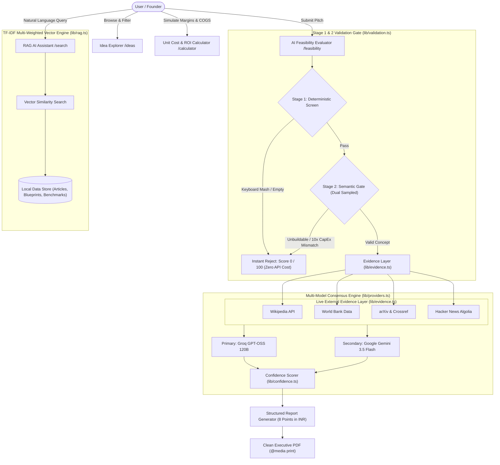

# NxtVenture — Manufacturing & Hardware Startup Navigator

[](https://nextjs.org/)
[](https://react.dev/)
[](https://tailwindcss.com/)
[](https://www.typescriptlang.org/)
[](https://startup-navigator-taupe.vercel.app/)
[](LICENSE)

NxtVenture is an enterprise-grade, full-stack web application designed for hardware founders, industrial product designers, D2C brand creators, and venture investors. Inspired by curated startup intelligence databases like 10,000 Ideas and IdeaBrowser, the application transforms raw hardware and manufacturing concepts into production-ready blueprints complete with unit economics in Indian Rupees (₹ INR), Bill of Materials (BOM), 4-vector risk assessments, RAG-assisted legal lookup, garbage data input shielding, dual-stage feasibility validation, and executive PDF exports.

---

## Candidate Status and Availability

- **Immediate Availability:** YES (0 Days Notice / Immediate Joiner)
- **Live Application URL:** [https://startup-navigator-taupe.vercel.app/](https://startup-navigator-taupe.vercel.app/)
- **GitHub Repository:** [https://github.com/aryan8434/startup-navigator](https://github.com/aryan8434/startup-navigator)

---

## Problem Statement & Target Personas

Building physical products and hardware startups presents unique challenges compared to pure software SaaS: high upfront capital expenditure (CapEx), supply chain dependencies, regional supplier fragmentation, and complex Bill of Materials (BOM) cost structures. Most early-stage founders lack quick access to reliable unit economics and risk modeling, while venture investors waste dozens of hours auditing unviable physical product concepts.

NxtVenture bridges this gap with structured data pipelines and evidence-grounded AI evaluation tailored for three primary personas:

| Persona | Core Pain Points | NxtVenture Solution |
| :--- | :--- | :--- |
| **Hardware & Manufacturing Founders** | Complex unit economics, tooling capex estimation, component sourcing uncertainty in India. | Instant BOM breakdown, unit COGS in ₹ INR, machinery capex estimates, and supplier hub benchmarks (Rajkot, Pune, Noida). |
| **Early-Stage VCs & Angel Investors** | Evaluating unvetted physical hardware pitch decks; inconsistent feasibility assessment metrics. | Standardized 0-100 Feasibility Gauge, 4-vector risk assessment, independent dual-model consensus, and executive PDF export. |
| **Industrial & Product Designers** | Translating product sketches into low-volume manufacturing pilot plans and assembly steps. | Structured 8-point manufacturing blueprint, tooling workflows, regulatory compliance checks, and RAG legal lookup. |

---

## System Architecture and Workflow

The system employs a multi-tiered architecture that isolates deterministic validation, real-time external evidence retrieval, dual-model AI consensus evaluation, and TF-IDF vector search.

### High-Level Architectural Flow



### ASCII Architecture Diagram

```
                                    ┌───────────┐
                                    │   USER    │
                                    └─────┬─────┘
                                          │
                                    ┌─────▼─────┐
                                    │   LOGIN   │
                                    └─────┬─────┘
           ┌──────────────────────────────┼──────────────────────────────┐
           │                              │                              │
           ▼                              ▼                              ▼
┌────────────────────┐          ┌────────────────────┐         ┌───────────────────┐
│   IDEA EXPLORER    │          │   AI FEASIBILITY   │         │     AI SEARCH     │
└──────────┬─────────┘          └─────────┬──────────┘         └─────────┬─────────┘
           │                              │                              │
 ┌─────────┴─────────┐              ┌─────▼─────┐                        │
 │                   │              │ VALID OR  │                        │
 ▼                   ▼              │   NOT?    │                        ▼
┌──────────────┐ ┌──────────────┐   └──┬─────┬──┘               ┌───────────────────┐
│ AI GENERATE  │ │  SUBMIT AN   │      │     │                  │   USER SEARCHES   │
│  FRESH IDEA  │ │     IDEA     │   NO │     │ YES              └─────────┬─────────┘
└──────┬───────┘ └──────┬───────┘      │     │                            │
       │                │              ▼     ▼                            ▼
       └────────┬───────┘       ┌──────────┐ ┌──────────────┐   ┌───────────────────┐
                │               │ SCORE: 0 │ │    MODEL     │   │ AI RAG RETRIEVAL  │
                ▼               │ (PREVENTS│ │  SELECTION   │   └─────────┬─────────┘
          ┌──────────┐          │ API COST)│ │(GROQ/GEMINI) │             │
          │   IDEA   │          └──────────┘ └──────┬───────┘             │
          └─────┬────┘                              │                     ▼
     ┌──────────┴───────────┐                       ▼           ┌───────────────────┐
     │                      │               ┌──────────────┐    │  CITED RESULTS    │
     ▼                      ▼               │ GENERATE REPORT│  └───────────────────┘
┌──────────────┐   ┌─────────────────┐      └──────┬───────┘
│  STORED IN   │   │  USER PERFORMS  │             │
│  VECTOR DB   │   │  AI FEASIBILITY ├─────────────┘
└──────────────┘   └─────────────────┘             │
                                                   ▼
                                           ┌──────────────┐
                                           │  STORED IN   │
                                           │  VECTOR DB   │
                                           └──────────────┘

┌───────────────────────────────────────────────────────────────────────────────────┐
│                               VECTOR DATABASE ENGINE                              │
│       • Ideas Directory   • Feasibility Reports   • Current Market Caps & Benchmarks │
└───────────────────────────────────────────────────────────────────────────────────┘
```

---

## Features & Route Matrix

### Core Application Matrix

| Route | Module | Core Functionality | Primary Tech / Dependencies |
| :--- | :--- | :--- | :--- |
| **`/`** | **Homepage & Market Pulse** | Live directory metrics, category quick-filters, featured blueprints, and unified search. | Server Component, Lucide Icons, Glassmorphic Hero |
| **`/ideas`** | **Hardware Idea Explorer** | Multi-attribute filtering (Category, Capex Tier, Complexity), upvoting, and instant AI idea generation. | Client state, Groq / Gemini API, `data/db.json` |
| **`/ideas/[id]`** | **Blueprint Detail View** | Unit economics in ₹ INR, BOM breakdowns, tooling capex, machinery specs, and **1-Click Feasibility Transfer**. | Dynamic Routing, JSON schema, localStorage bridge |
| **`/feasibility`** | **AI Feasibility & Risk Engine** | Evidence-grounded assessment, 0-100 gauge, 4-vector risk matrix, confidence score, and executive PDF export. | `lib/validation.ts`, `lib/evidence.ts`, `lib/confidence.ts` |
| **`/calculator`** | **Unit Cost & ROI Simulator** | Interactive slider simulator for BOM COGS, overhead, break-even unit volume, and payback schedules. | Pure Client-side Math, zero-latency reactive state |
| **`/search`** | **RAG AI Knowledge Assistant** | Vector similarity retrieval over local startup guides, blueprints, and reports with live source citations. | `lib/rag.ts` (TF-IDF Vector Engine), Groq/Gemini |
| **`/api/health`** | **Provider Health Endpoint** | Real-time active model identification, roundtrip latency probes, and degradation alerts. | `GET /api/health`, `lib/providers.ts` |

### Key Feature Capabilities

- **Idea Explorer Directory (`/ideas`):** Browse hardware concepts filtered by Category, Capex Tier, and Complexity. Includes upvoting, community submission, and instant AI idea generation.
- **1-Click AI Feasibility Transfer (`/ideas/[id]`):** Transfer parameters (Title, Sector, Capex Tier, Target Market, Description) directly from Idea Details to the Feasibility Evaluator with auto-execution.
- AI Feasibility and Risk Evaluator (/feasibility): Evidence-grounded analysis. Every pitch is researched against live public data, assessed independently by two AI models over identical evidence, and returned with inline [n] citations, a 0-100 feasibility gauge, a separate 0-100 confidence score, a 4-vector risk matrix, and an 8-point report in Indian Rupees (INR).
- Confidence Scoring (`lib/confidence.ts`): A second, independent score answering "how much should you trust this verdict?" - computed from evidence volume, source authority, source diversity, cross-model agreement, pitch specificity, internal knowledge overlap, and calibration against comparable past assessments. It is derived from observable facts, never asked of the model, so a confident-sounding completion cannot inflate it.
- Cited Sources Panel: Every external source used is listed with its provider, retrieval timestamp and link, and citation markers in the report body link back to it.
- Provider Health Endpoint (`/api/health`): Sends a real completion to each configured provider and reports the model that answered plus its latency, so a retired model id surfaces immediately instead of silently degrading to offline placeholder text.
- Two-Stage Validation Gate (`lib/validation.ts`): Nothing expensive runs until a pitch clears both stages.
  - Stage 1 (free, deterministic): empty input, too-short input and keyboard mashes ("fgbfg") are rejected with zero API cost.
  - Stage 2 (one cheap grounded call, sampled twice): judges whether the concept is real at all. Catches pitches that read as valid English but are not assessable - a product its stated user cannot physically use ("headphones for fishes"), a goal rather than a product ("I want to be rich"), a head-on clone of a dominant incumbent with no stated wedge, or capital off by 10x or more in either direction (a garment unit demanding INR 100 crore, a semiconductor fab on INR 4 lakh).
  - A rejected pitch returns 0 / 100 with no financial figures at all, and the report shows which stage stopped it. Rejections resolve in ~2-6s against ~9-25s for a full assessment.
- RAG AI Search Assistant (/search): Retrieval-Augmented Generation indexing Articles, Manufacturing Ideas, and Feasibility Audit Reports for natural language vector query processing with citations.
- Manufacturing Cost and ROI Calculator (/calculator): Interactive simulator for unit COGS, monthly fixed overhead, gross margin %, break-even unit volume, and payback schedules.
- **Clean PDF Report Export:** Dedicated print stylesheet formatting AI feasibility reports as executive white-background documents.

---

## Two-Stage Validation Gate Architecture (`lib/validation.ts`)

A critical challenge in AI-driven startup audit platforms is shielding the inference pipeline from junk inputs, keyboard mashes, physically impossible concepts, and severe financial hallucinations. NxtVenture solves this via a hierarchical **Two-Stage Validation Gate** before any expensive inference runs.

```
Incoming Pitch
      │
      ▼
┌───────────────────────────────────────┐
│ Stage 1: Deterministic Screen         │  ── Reject ──►  Score: 0 / 100 | Time: ~0.001s | Cost: $0.00
│ • Minimum word & character counts     │                 (Empty, keyboard mash "fgbfg", gibberish)
│ • Consonant-cluster entropy checks    │
└──────────────────┬────────────────────┘
                   │ Pass
                   ▼
┌───────────────────────────────────────┐
│ Stage 2: Dual-Sampled Semantic Gate   │  ── Reject ──►  Score: 0 / 100 | Time: ~2-6s | Cost: ~$0.0001
│ • Grounded lightweight model call     │                 (Non-physical "headphones for fishes",
│ • Dual parallel samples (either fails)│                  "I want to be rich", 10x capex mismatch)
│ • Strict physical & economic filters  │
└──────────────────┬────────────────────┘
                   │ Pass
                   ▼
┌───────────────────────────────────────┐
│ Full Assessment Pipeline              │  ── Success ─►  Score: 0-100 | Time: ~9-25s
│ • 5-Source live evidence research     │                 (Full 8-point report in ₹ INR,
│ • Dual-model consensus evaluation     │                  BOM breakdown, 4-vector risk matrix)
└───────────────────────────────────────┘
```

### Stage Comparison Matrix

| Attribute | Stage 1: Deterministic Screen | Stage 2: Semantic Gate | Full Assessment Pipeline |
| :--- | :--- | :--- | :--- |
| **Execution Engine** | Local TypeScript Regex & Heuristics | Fast LLM (Sampled 2x in Parallel) | Dual Provider (Groq 120B + Gemini 3.5 Flash) |
| **API Cost** | **$0.00 (Zero API calls)** | **<$0.0002** (1 cheap prompt) | Standard inference cost |
| **Resolution Latency** | **< 2 ms** | **~2 – 6 seconds** | **~9 – 25 seconds** |
| **What It Catches** | Empty input, length < 15 chars, keyboard mashes (`fgbfg`, `asdfghjkl`) | Non-physical concepts, generic desires, clone without wedge, CapEx off by >10x | Valid hardware ventures needing deep audit |
| **Verdict on Failure** | Feasibility Score: `0`, Confidence: `0` | Feasibility Score: `0`, Confidence: `0` | Calculated 0-100 based on market metrics |

---

## UI and UX Design Decisions

- Dark Mode Glassmorphic Aesthetic: Base layer styled with Slate 950 (`#020617`) and translucent backdrop blur panels (`backdrop-blur-md`).
- Structured Card Layouts: Multi-box point formatting forcing every numbered report point (1 through 8) into individual containers.
- Color Token Hierarchy:
  - Purplish Tint (`bg-purple-950/80 text-purple-300`): Highlighted headings (e.g. Market Demand, Target Market).
  - Emerald Green (`bg-emerald-950/70 text-emerald-400`): Bold financial figures, unit margins, and price tags.
  - Crimson Red (`bg-red-600 text-white`): AI Generated Idea badges and invalid pitch warnings.
- Responsive Layout Engine: Built using flexbox and grid layouts optimized for mobile, tablet, and desktop viewports.

---

## Technologies Used

- Frontend: Next.js 16 (App Router), React 19, Tailwind CSS v4, Lucide React Icons, Google Fonts (Inter and Outfit)
- Backend: Next.js Server API Routes, Node Proxy layer (`proxy.ts`, replacing the deprecated `middleware.ts` convention in Next 16), JWT Cookie Authentication, Bcrypt Password Hashing, Async Temp File Write Queue
- AI Models: multi-provider router — Groq (GPT-OSS 120B / 20B, Qwen 3.8 27B), Google Gemini (3.5 Flash, 3.1 Flash Lite), optional OpenAI, with automatic model fallback and an offline extractive engine as last resort
- RAG Engine: Multi-Weighted TF-IDF Vector Similarity Search with stop-word filtering, plus a live external evidence layer (`lib/evidence.ts`)
- Live Data Sources (no API key required): Wikipedia, World Bank Open Data, Crossref, arXiv, Hacker News
- Database: JSON Atomic File Database (`data/db.json`) with `memorySchema` in-memory fallback for read-only serverless environments

---

## Step-by-Step Installation Guide

Follow these steps to set up and run NxtVenture locally on your machine:

### 1. Prerequisites
Ensure you have the following installed:
- Node.js (v18.0.0 or higher)
- npm (v9.0.0 or higher)
- Git

### 2. Clone the Repository
Open your terminal and run:
```bash
git clone https://github.com/aryan8434/startup-navigator.git
cd startup-navigator
```

### 3. Install Dependencies
Install all required Node.js modules:
```bash
npm install
```

### 4. Configure Environment Variables
Create a `.env` file in the root directory:
```bash
cp .env.example .env
```

Open `.env` and add your API keys (optional, offline fallback engine is active by default):
```env
GROQ_API_KEY=your_groq_api_key_here
GEMINI_API_KEY=your_gemini_api_key_here
JWT_SECRET=your_jwt_secret_key_here
```

### 5. Run the Local Development Server
Start the Next.js development server:
```bash
npm run dev
```

Open your browser and navigate to:
```
http://localhost:3000
```

### 6. Build for Production
To create an optimized production build:
```bash
npm run build
```

To run the production server locally:
```bash
npm start
```
