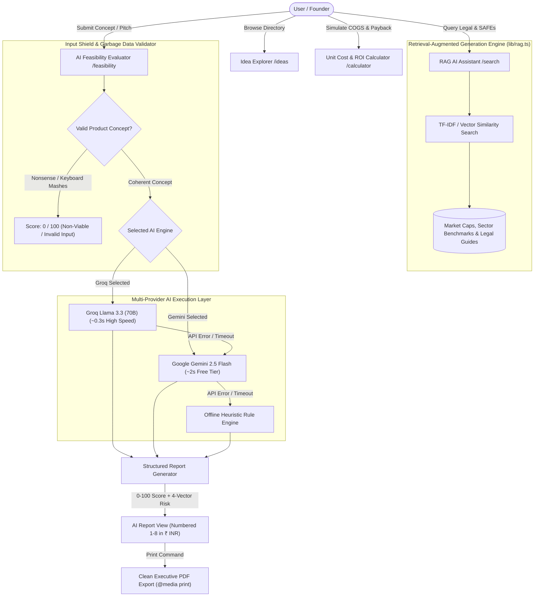

# NxtVenture — Technical Architecture & Vector Database Specification

---

## Vector Database Storage & Access Specification

### 1. Does the Vector DB Store Everything?
**YES.** The Retrieval-Augmented Generation (RAG) Vector Database in NxtVenture ([`lib/rag.ts`](file:///c:/Codes/assignments/startup-navigator/lib/rag.ts)) dynamically tokenizes and indexes all 4 core data entities:

- **Startup Knowledge Articles:** Company registration, SAFEs, Delaware filing, hiring equity, ESOPs, sales tax, and manufacturing lead times.
- **Manufacturing Idea Blueprints:** Seed ideas, user-submitted concepts, and AI-generated concepts.
- **AI Feasibility Audit Reports:** Numerical scores (0-100), verdicts, 4-vector risk matrices, COGS, MSRP pricing in INR, Bill of Materials, and 8-point detailed analyses.
- **Sector Market Caps & Benchmarks:** TAM/SAM/SOM market caps in INR Crores and regional supplier rates (Rajkot, Pune, Noida).

---

### 2. How to Access the Vector Database

| Access Method | Endpoint / Route | How to Use |
| :--- | :--- | :--- |
| **1. UI Search Bar** | [`/search`](https://startup-navigator-taupe.vercel.app/search) | Type any natural language question or idea title into the AI Search bar to trigger RAG vector retrieval. |
| **2. REST API Endpoint** | `POST /api/search` | Send JSON `{ "query": "your query", "aiModel": "groq" }` to retrieve vector matches programmatically. |
| **3. TypeScript Import** | [`lib/rag.ts`](file:///c:/Codes/assignments/startup-navigator/lib/rag.ts) | Call `executeRagSearch(query, preferredModel)` directly in any Next.js API route or Server Action. |

---

## Complete Technology Stack & System Components

| Layer | Technology Name | Role & Specification |
| :--- | :--- | :--- |
| **Frontend** | **Next.js 16 (App Router)** | Full-stack React framework utilizing Server & Client Components. |
| **UI & Styling** | **Tailwind CSS v4 & React 19** | Dark-mode glassmorphism styling (`Slate 950`), custom HSL color tokens, and `@media print` executive PDF engine. |
| **Icons & Typography** | **Lucide React & Google Fonts** | Lucide React Iconography with Google Fonts (*Inter* & *Outfit*). |
| **Backend** | **Next.js 16 Server API Routes** | RESTful JSON endpoints (`/api/feasibility`, `/api/ideas`, `/api/search`, `/api/articles`). |
| **Authentication** | **JWT & Bcrypt Cookie Auth** | Cookie-based session tokens with password hashing for security. |
| **Primary AI Engine** | **Groq Cloud Llama 3.3 (70B)** | High-speed generative inference engine (~0.3s latency) executing hardware audits and idea generation. |
| **Secondary AI Engine** | **Google Gemini 2.5 Flash** | Alternative free-tier LLM engine (under testing warning enabled). |
| **Fallback AI Engine** | **Offline Heuristic Rule Engine** | Offline manufacturing evaluation engine providing 100% uptime fallback. |
| **RAG Vector Engine** | **TF-IDF Multi-Weighted Vector Engine** | Custom vector similarity matching module (`lib/rag.ts`) with tokenization and stop-word filtering. |
| **Database (DB)** | **JSON Atomic Database (`data/db.json`)** | Persistence engine with temp-file locking queue (`DB_FILE.tmp`). |
| **Serverless DB Fallback** | **`memorySchema` In-Memory DB** | In-memory schema state fallback solving Vercel read-only filesystem (`EROFS`) constraints. |

---

## Executive Summary & Candidate Declarations

### Candidate Profile & Status
- **Immediate Availability:** **YES (0 Days Notice / Immediate Joiner)**
- **Live Published Application (Vercel):** [https://startup-navigator-taupe.vercel.app/](https://startup-navigator-taupe.vercel.app/)
- **GitHub Repository:** [https://github.com/aryan8434/startup-navigator](https://github.com/aryan8434/startup-navigator)

---

## 1. Requirement Analysis

### 1.1 Target Users & User Persona Mapping
* **Hardware & Manufacturing Founders:** Calculate unit economics, sourcing lead times, and tooling capex in Indian Rupees (₹).
* **Early-Stage VCs & Angels:** Require standardized feasibility scorecards, 0-100 numerical scores, and risk matrices to audit incoming physical product pitch decks.
* **Industrial & Product Designers:** Automated Bill of Materials (BOM) outlines and assembly workflows to validate low-volume manufacturing runs.

---

## 2. System Architecture & Workflow

