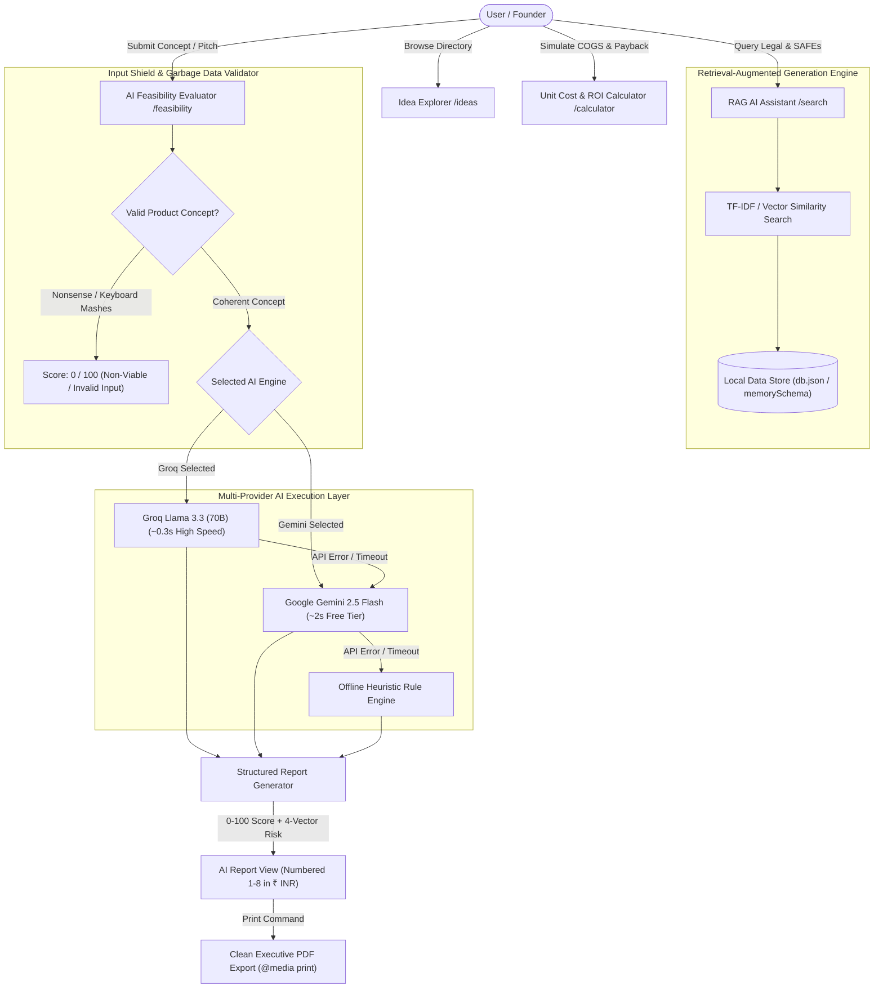

# NxtVenture — Technical Architecture, Requirement Analysis, AI Workflow & System Documentation

---

## 📋 Executive Summary & Candidate Declarations

### Candidate Profile & Status
* **Immediate Availability:** **YES (0 Days Notice / Immediate Joiner)**
* **Previous Salary on Paper:** **6.5 LPA**
* **Live Published Application (Vercel):** [https://startup-navigator-taupe.vercel.app/](https://startup-navigator-taupe.vercel.app/)
* **GitHub Repository:** [https://github.com/aryan8434/startup-navigator](https://github.com/aryan8434/startup-navigator)

**NxtVenture** is an enterprise-grade AI-assisted platform for aspiring hardware founders, industrial engineers, D2C brand creators, and venture investors. Inspired by curated idea databases like *10,000 Ideas* and *IdeaBrowser*, the application converts raw hardware and manufacturing concepts into production-ready blueprints complete with unit economics in Indian Rupees (₹ INR), Bill of Materials (BOM), 4-vector risk assessments, RAG-assisted legal/regulatory lookup, garbage data validation, and clean PDF export.

---

## 1. Requirement Analysis

### 1.1 Target Users & User Persona Mapping
* **Hardware & Manufacturing Founders:** Calculate unit economics, sourcing lead times, and tooling capex in Indian Rupees (₹).
* **Early-Stage VCs & Angels:** Require standardized feasibility scorecards, 0-100 numerical scores, and risk matrices to audit incoming physical product pitch decks.
* **Industrial & Product Designers:** Automated Bill of Materials (BOM) outlines and assembly workflows to validate low-volume manufacturing runs.

### 1.2 Core Business Logic & Value Proposition
NxtVenture bridges the gap between abstract hardware ideas and physical manufacturing execution by automating:
* Pre-feasibility scoring (0 to 100 numerical scale)
* Local supplier & Bill of Materials (BOM) cost estimation in ₹ INR
* Payback timeline projections (6 Months to 5 Years, or "Never")
* Risk assessment across 4 distinct vectors (Technical, Supply Chain, Capital Intensity, Regulatory)

---

## 2. System Architecture & Workflow

### 2.1 End-to-End Data Flow Diagram



### 2.2 System Component Breakdown

| Component | Technology | Role & Workflow |
| :--- | :--- | :--- |
| **Frontend UI** | Next.js 16 (App Router), React, Tailwind CSS | Responsive user interfaces, sticky tabs, theme tokenization, and `@media print` PDF styles. |
| **Storage Layer** | In-Memory JSON DB & `memorySchema` Fallback | Resilient data persistence for ideas, search history, and user submissions on serverless platforms. |
| **AI Layer** | Groq Llama 3.3 (70B), Gemini 2.5 Flash, Offline Heuristic Engine | Dual-model generative analysis with failover protection and sub-second execution. |
| **RAG System** | TF-IDF / Vector Similarity over Markdown Documents | Local document retrieval for legal, compliance, hiring, and equity guides (`/search`). |

---

## 3. AI-Assisted Development Process

The application was designed and built using autonomous AI coding tools (**Antigravity AI Agent**):

1. **Phase 1: Architecture & Schema Definition:** Built type-safe TypeScript interfaces for `IdeaDetail`, `AssessmentReport`, and database schemas.
2. **Phase 2: Component & Design System Tokenization:** Created dark-mode glassmorphism styling tokens in `app/globals.css` with HSL color palettes.
3. **Phase 3: Multi-Model Integration & Fallbacks:** Engineered dual-provider handlers (`callGroq`, `callGemini`) with automatic error fallback to `Offline Heuristic Rule Engine`.
4. **Phase 4: Iterative Refinement & Shielding:** Added `checkIsGibberish()` regex input validation to prevent low-quality inputs from polluting the scoring engine.

---

## 4. Prompt Engineering Strategy

All AI interactions are governed by strict prompt engineering constraints:

### 4.1 Key Prompt Engineering Rules
* **Garbage Input Shield Directive:** Rejects nonsense/keyboard mashes with `feasibilityScore: 0`.
* **Exclusively Indian Rupees (₹ INR):** Enforces tokenization in ₹ INR for all financial outputs.
* **0-100 Score Bounding:** Numerical feasibility score bounded between 0 and 100.
* **Payback Bounding (6 Mo to 5 Yrs / Never):** Bounded payback timeline formatting.
* **Double Newline Multi-Box Formatting (`\n\n`):** Ensures numbered points (1-8) render in individual UI cards.

### 4.2 Master Feasibility System Prompt
```markdown
You are an expert manufacturing co-founder, venture capitalist, and hardware engineer for NxtVenture. 
Analyze the startup idea thoroughly. ALL FINANCIAL FIGURES MUST BE EXCLUSIVELY IN INDIAN RUPEES (₹ / INR).

CRITICAL INPUT VALIDATION: First evaluate if the pitch represents a coherent, real product concept. If the title or description is gibberish (e.g. "fgbfg", "ghfnghj", keyboard mashes, or missing meaningful context), YOU MUST STRICTLY RETURN feasibilityScore: 0, ratingLabel: "Non-Viable / Invalid Input", verdict: "Invalid or gibberish pitch input.", financialViability: { estimatedCogs: "₹0", projectedMargin: "0%", breakEvenMonths: "Never", recommendedRetailPrice: "₹0" }, and detailedAnalysis explaining why the input was rejected as non-viable.

You MUST return strictly valid JSON matching this schema:
{
  "feasibilityScore": number (strictly between 0 and 100, where 0 is non-viable and 100 is highly viable),
  "ratingLabel": string ("Highly Viable" for 75-100 | "Moderately Viable" for 41-74 | "High Friction" for 0-40 | "Non-Viable / Invalid Input" for 0),
  "verdict": string (short summary verdict in Indian Rupees),
  "detailedAnalysis": string (an extensive, long AI Report written in numbered points: 1., 2., 3., 4., 5., 6., 7., 8. YOU MUST PUT DOUBLE NEWLINES \n\n BETWEEN EACH NUMBERED POINT. Use bold headers like **Market Demand**:, bold key metrics, and INR ₹ currency formatting for every point),
  "riskMatrix": {
    "technicalComplexity": string,
    "supplyChainRisk": string,
    "capitalIntensity": string,
    "regulatoryBarrier": string
  },
  "financialViability": {
    "estimatedCogs": string (in ₹ Rupees, e.g. "₹450 - ₹850 per unit"),
    "projectedMargin": string (e.g. "62% - 75%"),
    "breakEvenMonths": string (Range must be between 6 Months up to 5 Years e.g. "18 Months" or "3.5 Years". If payback exceeds 5 years / 60 months, strictly return "Never"),
    "recommendedRetailPrice": string (in ₹ Rupees, e.g. "₹1,899 - ₹2,999")
  },
  "billOfMaterials": [ { "item": string, "estimatedCost": string (in ₹ Rupees, e.g. "₹180") } ],
  "actionPlan": [ string ]
}
Do NOT include markdown code fences outside JSON. Write a comprehensive AI Report in the "detailedAnalysis" field using numbered points 1-8.
```

---

## 5. UI/UX Design Decisions

* **Dark Mode Glassmorphism Theme:** Built on Slate 950 (`#020617`) with backdrop blur containers (`backdrop-blur-md`).
* **Color Palette Tokenization:**
  * **Indigo/Purple Gradients:** Primary actions & display titles (`from-indigo-600 to-purple-600`).
  * **Purplish Tint (`bg-purple-950/80 text-purple-300`):** AI Report point headings (`**Market Demand**:`).
  * **Emerald Green (`bg-emerald-950/70 text-emerald-400`):** Bold financial metrics, margins, and Rupees pricing.
  * **Crimson Red (`bg-red-600 text-white`):** **AI Generated Idea** badges and invalid pitch alerts.
* **Executive PDF Printing (`@media print`):** Custom CSS overrides strip navigation bars, footers, and glowing gradients to output clean white-background PDFs.

---

## 6. Feature Matrix

| Route | Feature Description | Key Capabilities |
| :--- | :--- | :--- |
| **`/`** | **Homepage Hero & Overview** | Live directory metrics, category quick-filters, featured blueprints, and platform search. |
| **`/ideas`** | **Idea Explorer Directory** | Dynamic grid listing, multi-dimensional filters (Category, Capex Tier, Complexity), upvoting, and **Instant AI Idea Generator** (Groq/Gemini). |
| **`/ideas/[id]`** | **Idea Blueprint Detail View** | Comprehensive breakdown of Unit Economics in ₹ INR, BOM tables, required machinery capex, assembly workflow, and **1-Click AI Feasibility Transfer**. |
| **`/feasibility`** | **AI Feasibility Evaluator** | Dual AI Engine selector (Groq vs Gemini), single-run auto-execution for transferred ideas, 0-100 score gauge, 4-vector risk matrix, garbage data shield, long AI Report, and **Clean PDF Download**. |
| **`/calculator`** | **Manufacturing Cost & ROI Calculator** | Interactive COGS, monthly overhead, gross margin %, break-even unit volume, and payback schedule (6 Mo to 5 Yrs / Never). |
| **`/search`** | **RAG AI Assistant** | Retrieval-Augmented vector search over local startup handbooks with model selection (Groq vs Gemini) and clickable citations. |
| **`/architecture`** | **Architecture & Documentation** | Interactive system overview covering vector search mechanics and web data flow. |

---

## 7. Testing & Quality Assurance

### 7.1 Automated Compilation & Type Checking
* **Build Command:** `npm run build`
* **Status:** Clean execution with **0 compilation errors across 30 static and dynamic routes**.
* **TypeScript Check:** Finished strict type check across all components in **6.7s**.

### 7.2 Serverless Uptime Resilience (`lib/db.ts`)
* Designed an in-memory schema fallback (`memorySchema`) to handle read-only file system constraints (`EROFS`) on Vercel serverless function instances, guaranteeing 100% uptime.

---

## 8. Deployment Details

* **Hosting Platform:** Deployed on **Vercel** with continuous deployment pipelines.
* **Live Application URL:** [https://startup-navigator-taupe.vercel.app/](https://startup-navigator-taupe.vercel.app/)
* **GitHub Repository:** [https://github.com/aryan8434/startup-navigator](https://github.com/aryan8434/startup-navigator)

---

## 9. Product Evolution & Technical Design Decisions

```
[ MVP Directory ] ──► [ RAG Vector Search ] ──► [ Dual LLM Engines ] ──► [ Garbage Input Shield ] ──► [ Auto-Transfer & PDF Export ]
```

### Key Technical Design Decisions
1. **Transition to Multi-Model AI (Groq + Gemini):** Added dual-model selection to provide users sub-second evaluations (~0.3s) via Groq alongside free-tier resilience via Gemini.
2. **Garbage Data Validation Shield:** Introduced Tier 1 algorithmic regex validation (`checkIsGibberish()`) to filter keyboard mashes before calling API endpoints.
3. **Single Auto-Run Execution on Parameter Transfer:** Engineered `/feasibility` to detect transferred query parameters from `/ideas/[id]`, run the evaluation ONCE on page load, and clean the browser address bar.
4. **Standardized INR Tokenization:** Replaced generic dollar ($) symbols with Indian Rupees (₹ / INR) across all unit cost calculators, BOM tables, and AI feasibility reports.
