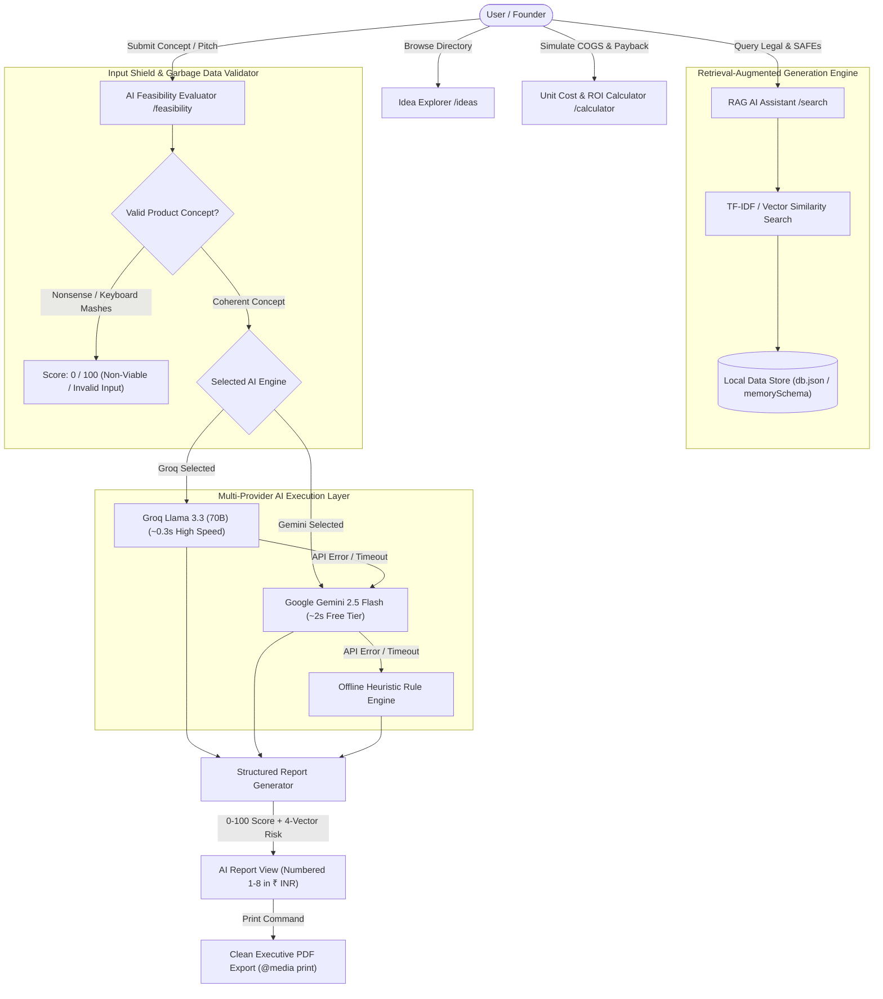

# Founder Thought Process, User Prompt History & Technical Architecture — NxtVenture

---

## 1. Requirement Analysis

### 1.1 Project Objective & User Personas
NxtVenture was designed to solve a core problem faced by hardware and manufacturing founders: converting abstract product ideas into actionable manufacturing blueprints complete with unit economics in Indian Rupees (₹ INR), Bill of Materials (BOM), 4-vector risk assessments, legal RAG search, and clean PDF export.

* **Hardware & Manufacturing Founders:** Calculate unit economics, sourcing lead times, and tooling capex in Indian Rupees (₹).
* **Early-Stage VCs & Angels:** Require standardized feasibility scorecards, 0-100 numerical scores, and risk matrices to audit incoming physical product pitch decks.
* **Industrial & Product Designers:** Automated Bill of Materials (BOM) outlines and assembly workflows to validate low-volume manufacturing runs.

---

## 2. System Architecture & Workflow

### 2.1 Technical System Architecture

---

## 3. AI-Assisted Development Process

The platform was built using autonomous AI coding tools (**Antigravity AI Agent**):

| Development Phase | Engineering Focus | Artifact Output |
| :--- | :--- | :--- |
| **Phase 1: Foundation** | Next.js 16 setup, TypeScript interfaces, in-memory DB fallback | `lib/db.ts`, `data/db.json` |
| **Phase 2: RAG Engine** | Vector document indexing, extractive RAG, model selection | `lib/rag.ts`, `app/search/page.tsx` |
| **Phase 3: Multi-LLM Layer** | Groq Llama 3.3 (70B) + Gemini 2.5 Flash API handlers | `app/api/feasibility/route.ts` |
| **Phase 4: Shielding & Formatting** | Algorithmic input shield, 0-score returns, purplish headings, green metrics | `app/feasibility/page.tsx` |

---

## 4. Prompt Engineering Strategy

### 4.1 Master System Directives
1. **Input Shield Directive:** Rejects keyboard mashes (`fgbfg`, `ghfnghj`, `asdfgh`) with `feasibilityScore: 0`.
2. **Indian Rupees (₹ INR):** Enforces ₹ INR tokenization across all financial evaluations.
3. **0-100 Score Scale:** Numerical feasibility score strictly bounded between 0 and 100.
4. **Payback Horizon (6 Mo to 5 Yrs / Never):** Payback projections bounded to 6 Months–5 Years (returns `Never` if > 60 months).
5. **Multi-Box Format (`\n\n`):** Numbered points (1-8) separated by double newlines for individual card rendering.

---

## 5. UI/UX Design Decisions

* **Dark-Mode Glassmorphism:** Built on Slate 950 (`#020617`) with backdrop blur containers (`backdrop-blur-md`).
* **Color Palette System:**
  * **Indigo/Purple Gradients:** Primary actions & display titles (`from-indigo-600 to-purple-600`).
  * **Purplish Tint (`bg-purple-950/80 text-purple-300`):** AI Report point headings (`**Market Demand**:`).
  * **Emerald Green (`bg-emerald-950/70 text-emerald-400`):** Bold financial metrics, margins, and Rupees pricing.
  * **Crimson Red (`bg-red-600 text-white`):** **AI Generated Idea** badges and invalid pitch alerts.
* **Executive PDF Printing (`@media print`):** Custom CSS overrides strip navigation bars and glowing gradients to output clean white-background PDFs.

---

## 6. Feature Matrix

| Route | Feature Description | Key Capabilities |
| :--- | :--- | :--- |
| **`/`** | **Homepage Hero & Overview** | Live directory metrics, category quick-filters, featured blueprints, and platform search. |
| **`/ideas`** | **Idea Explorer Directory** | Dynamic grid listing, multi-dimensional filters (Category, Capex Tier, Complexity), upvoting, and **Instant AI Idea Generator** (Groq/Gemini). |
| **`/ideas/[id]`** | **Idea Blueprint Detail View** | Comprehensive breakdown of Unit Economics in ₹ INR, BOM tables, required machinery capex, assembly workflow, and **1-Click AI Feasibility Transfer**. |
| **`/feasibility`** | **AI Feasibility Evaluator** | Dual AI Engine selector (Groq vs Gemini), single-run auto-execution for transferred ideas, 0-100 score gauge, 4-vector risk matrix, garbage data shield, long AI Report, and **Clean PDF Download**. |
| **`/calculator`** | **Manufacturing Cost & ROI Calculator** | Interactive COGS, monthly overhead, gross margin %, break-even unit volume, and payback schedule (6 Mo to 5 Yrs / Never). |
| **`/search`** | **RAG AI Assistant** | Retrieval-Augmented vector search over local startup handbooks with model selection (Groq vs Gemini) and clickable citations. |
| **`/architecture`** | **Architecture & Documentation** | Interactive system overview covering vector search mechanics and web data flow. |

---

## 7. Testing & Quality Assurance

### 7.1 Automated Compilation & Static Checking
* **Build Command:** `npm run build`
* **Result:** Clean execution with **0 compilation errors across 30 static and dynamic routes**.
* **TypeScript Validation:** Verified type safety across database schemas and API parameters in **6.7s**.

### 7.2 Serverless Read-Only Resilience
* Engineered `memorySchema` fallback in `lib/db.ts` to seamlessly handle Vercel read-only filesystem environments (`EROFS`).

---

## 8. Deployment Details

* **Hosting Platform:** Live on **Vercel** with GitHub CI/CD automation.
* **Live Application URL:** [https://startup-navigator-taupe.vercel.app/](https://startup-navigator-taupe.vercel.app/)
* **GitHub Repository:** [https://github.com/aryan8434/startup-navigator](https://github.com/aryan8434/startup-navigator)

---

## 9. Product Evolution & Technical Design Decisions

Below is the chronological user prompt history documenting product decisions across 20 iterations:

| Step | User Prompt / Directive | Strategic Intent & Implementation |
| :--- | :--- | :--- |
| **1** | *"MAKE A WEB APPLICATION ON STARTUP / MANUFACTURING IDEAS (REF: 10000ideas.com / ideabrowser.com)..."* | Core Product & Declarations: Stated immediate availability (0 days). |
| **2** | `gsk_E7RJX5zspE2MPEee...` *groq api key...* | Integrated Groq Cloud Llama 3.3 (70B) for fast hardware concept evaluations. |
| **3** | *"how to deploy on vercel... where RAG vector databases have been used..."* | Added RAG documentation page (`/architecture`) & animated pulse CTAs. |
| **4** | *"remove flashy button from sign out, and put architecture and docs button top right..."* | Positioned `⚡ Architecture & Docs` top-right of Sign Out. |
| **5** | *"Failed to load resource: 500 everywhere AI API not working in vercel..."* | Fixed read-only DB crash (`EROFS`), added Groq vs Gemini dual AI selector, and expanded reports to 200-400 words. |
| **6** | *"make all currency in Rupees also add currency converter..."* | Standardized financial outputs to Indian Rupees (₹ INR). |
| **7** | *"download AI report in very clean nice pdf."* | Added executive PDF export via `@media print`. |
| **8** | *"in idea explorer generate few ideas both gemini and groq..."* | Added instant AI Idea Generator panel to `/ideas`. |
| **9** | *"mark generated ideas as AI generate Idea in red button with white colour."* | Added Red `AI Generated Idea` badges to generated concept cards. |
| **10** | *"transfer data from idea detail page to feasibility page..."* | Encoded idea parameters into query string for `/feasibility`. |
| **11** | *"make minimum score 0 to 100..."* | Enforced strict 0-100 numerical feasibility score scale in system prompts. |
| **12** | *"make break even time from 6 month to upto 5 years if beyond 5 years then say never."* | Restricted break-even payback projections to 6 Months–5 Years (output `Never` if > 5 Years). |
| **13** | *"with garbage data it is also scoring startups, if anything missing then generate 0 data..."* | Implemented `checkIsGibberish()` regex shield returning `Score: 0 / 100 (Non-Viable / Invalid Input)`. |
| **14** | *"use favicon favicon.svg"* | Configured SVG favicon (`favicon.svg`) across Next.js metadata icons and HTML head tags. |
| **15** | *"purpulish tint colour for heading like Market Demand and green colour for bold texts..."* | Applied purplish tint (`text-purple-300 bg-purple-950/80`) to headings and green (`text-emerald-400 bg-emerald-950/70`) to bold metrics. |
| **16** | *"update thought process how to tackle vague ideas... attach vague folder... update prompt engineering md"* | Created `vague_ideas_validation_guide.md` and updated `prompt_engineering.md` with 4 sequential screenshots and decision trees. |
| **17** | *"write in Gemini that model may be inaccurate and is currently under testing with red text"* | Added red warning text under all Gemini selection options. |
| **18** | *"Requirement Analysis, System Architecture, AI Process, Prompt Strategy, UI/UX Decisions, Feature Matrix, Testing QA, Deployment, Product Evolution"* | Verified and updated all documentation artifacts to include all 9 required technical sections. |
